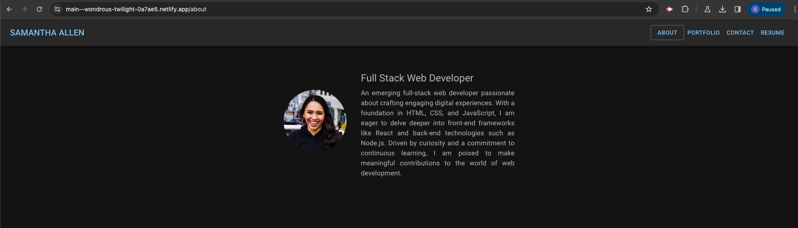
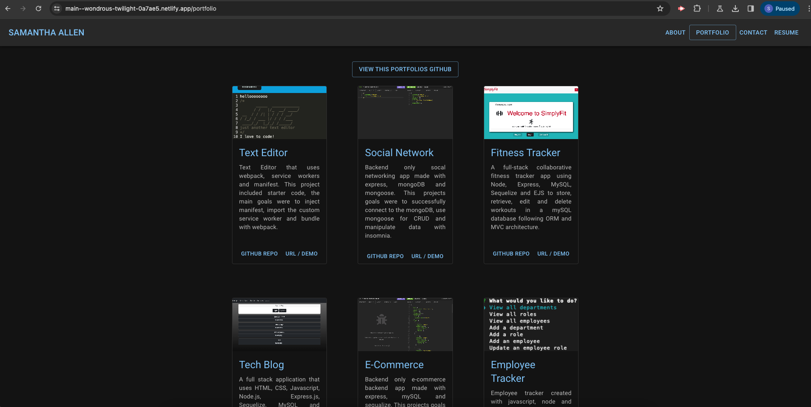
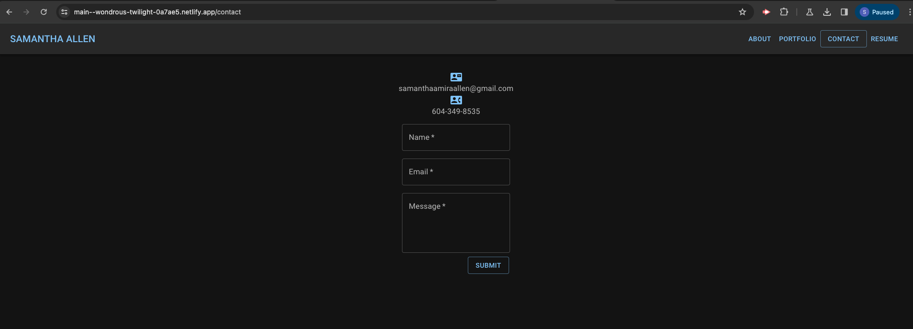
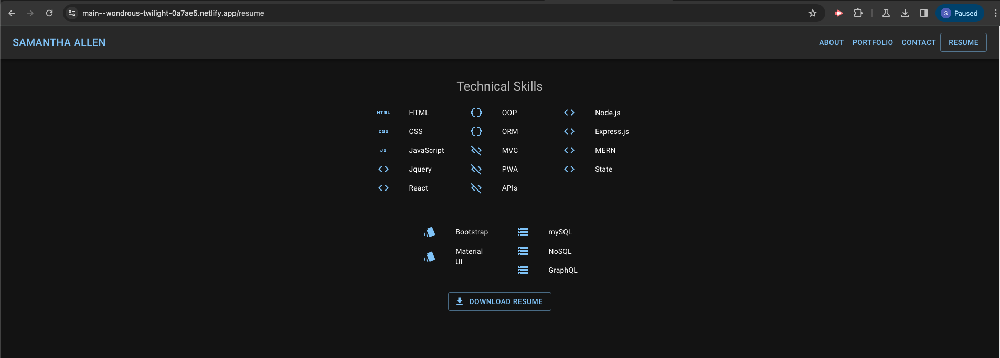
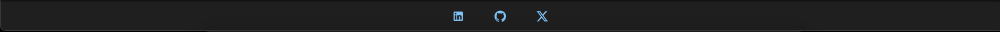
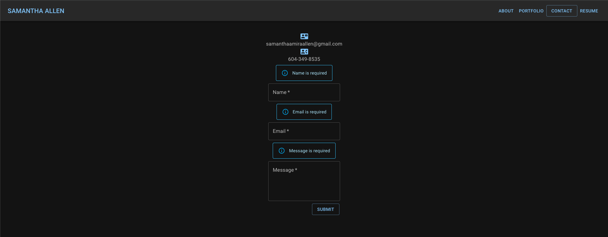
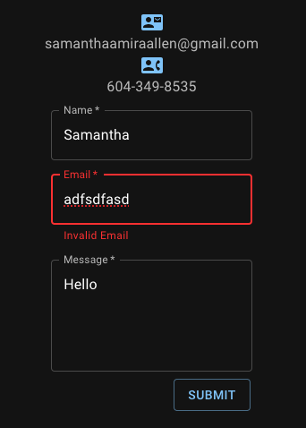
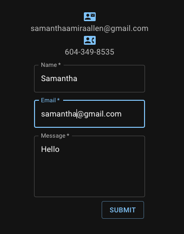

# Portfolio

Live URL 👇🏼 
https://samanthaallen.netlify.app/
## Description

Portfolio created with React and Material UI. My motivation was seeing the improvement in my first portfolio and this one. This is an important project to build because every developer should have a portfolio. I learned how to use Material UI (of course there is still much more to learn), but it was a good start.

## Table of Contents 

- [Installation](#installation)
- [Usage](#usage)
- [Credits](#credits)
- [License](#license)

## Installation

npm run install 
pm start if running throught localhost, otherwise see deployed application 

## Usage

When you first load my portfolio, the default page is the about page 
 
 
 
The navigation bar has 4 links that can take you to the pages 'about', 'portfolio', 'contact', and 'resume'. 
 
 
 
 
 
 
 
 
 
Every page has the footer that has 3 icon links to my github, linkedin and twitter 
 
 
 
On the contact page if you hover your mouse over an input an alert pops up saying the specific field is required 
 
 
 
When you enter text in the email input, an invalid emaill error shows up and disappears once a valid email is entered 
 
 
 
 
 

## Credits

I always refer to class activities, but thank you to my tutor Andrew and my colleague Shawn for all of their help. 

https://www.youtube.com/watch?v=Xoz31I1FuiY 
https://dev.to/parthgupta118/mouse-events-onmouseout-and-onmouseleave-in-react-1fpd 
https://www.w3schools.com/jsref/jsref_regexp_test.asp 
https://mui.com/material-ui/react-alert/ 

## License

The MIT License is short and to the point. It lets people do almost anything they want with your project, like making and distributing closed source versions.

## Tests

Download my resume and check out all my links!
